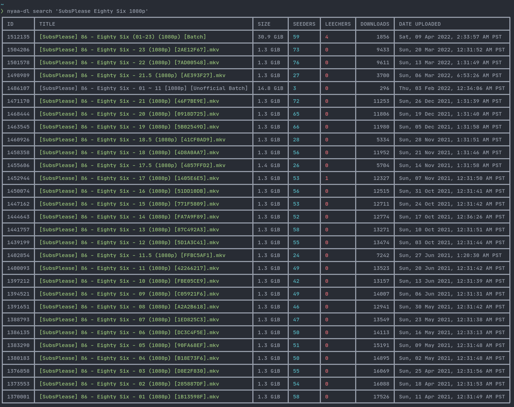

<div align="center">
  <h1>nyaa-dl</h1>
</div>




# CLI application for downloading Nyaa torrent files

## Usage
### Search for Torrent
```bash
nyaa-dl search 'Subsplease Eighty Six 1080p'
```

### Download Torrent File
```bash
nyaa-dl download <torrent ID from search>
```
File will be saved to `/home/$USER/Downloads/nyaa-dl/` directory

### Help
```bash
nyaa-dl --help
```
Outputs available sub commands e.g. download and search

```bash
nyaa-dl search --help
```
Outputs search specific flags like `--filter=<filter>` `--order=<order>` `--sort=<sort>`
